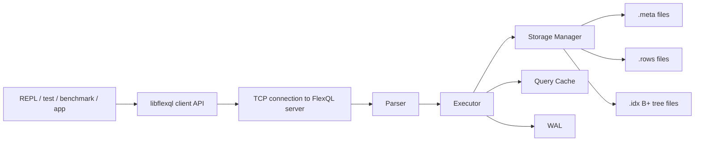
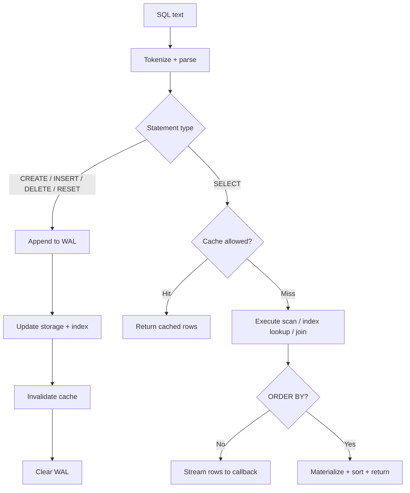

# FlexQL

FlexQL is a lightweight relational database engine implemented in C/C++ with a loopback-only client/server runtime, disk-backed table storage, a persisted primary-key B+ tree index, a small LRU query cache, and WAL-based crash recovery.

The repository currently builds:

- `bin/flexql_server`: multithreaded TCP server
- `bin/flexql_repl`: interactive client shell
- `bin/libflexql.a` and `bin/libflexql.so`: client library
- `bin/test_driver`: compatibility and regression tests
- `bin/benchmark_flexql`
- `bin/benchmark_flexql_join`
- `bin/benchmark_after_insert`

## What The Code Supports

FlexQL implements a focused SQL subset that matches the parser and executor in this repository:

- `CREATE TABLE [IF NOT EXISTS] table_name (col type, ...)`
- `INSERT INTO table_name VALUES (...), (...), ...`
- `SELECT ... FROM table_name`
- `WHERE` predicates with `=`, `!=`, `<`, `<=`, `>`, `>=`
- `INNER JOIN ... ON ...`
- `ORDER BY <selected-column>`
- `DELETE FROM table_name`
- `RESET table_name`

Important implementation details:

- The first column of every table acts as the indexed primary lookup key.
- `DELETE FROM table` and `RESET table` both clear all rows in the table in the current codebase.
- If a table contains a column named `EXPIRES_AT`, rows whose timestamp is older than the current epoch time are skipped during reads.
- `ORDER BY` is supported only when the ordered column also appears in the `SELECT` list.
- The server accepts only loopback hosts: `127.0.0.1` or `localhost`.

## Architecture





## Persistent Layout

FlexQL stores data under `data/`:

- `data/tables/<table>.meta`: schema metadata, row count, and expiration-column index
- `data/tables/<table>.rows`: append-only row file containing serialized field values
- `data/indexes/<table>.idx`: persisted B+ tree index on the first column
- `data/wal/flexql.wal`: write-ahead log used for replay on startup

Row storage is binary and compact:

- `uint32 field_count`
- repeated `uint32 value_len + value_bytes`

The metadata file tracks:

- table name
- column count
- row count
- index of `EXPIRES_AT` if present
- column names and declared types

## Query Execution Behavior

`SELECT` execution takes one of three main paths:

1. Primary-key point lookup  
   If the query is a single-table `WHERE first_column = literal`, the executor uses the `.idx` file to jump directly to the row offset in the `.rows` file.

2. Sequential scan  
   All other single-table predicates are evaluated by scanning the row file and testing conditions row by row.

3. Join execution  
   `INNER JOIN` uses an indexed join when one side of the join condition references column `0` of a table and the operator is `=`. Otherwise it falls back to a nested-loop join.

Caching behavior:

- A small in-memory LRU cache stores complete `SELECT` results by SQL string.
- Cached results are invalidated on `CREATE`, `INSERT`, `DELETE`, and `RESET`.
- Queries against tables with `EXPIRES_AT` are intentionally not cached.

Recovery behavior:

- Mutating statements are appended to the WAL before execution.
- On successful completion, the WAL is cleared.
- On server startup, the WAL is replayed before the server starts accepting requests.

## Build

```bash
make clean all
```

Artifacts are written to `build/` and `bin/`.

## Run

Start the server:

```bash
./bin/flexql_server 9000
```

Start the REPL in a second terminal:

```bash
./bin/flexql_repl
```

Example session:

```sql
CREATE TABLE IF NOT EXISTS TEST_USERS(
  ID DECIMAL,
  NAME VARCHAR(64),
  BALANCE DECIMAL,
  EXPIRES_AT DECIMAL
);

INSERT INTO TEST_USERS VALUES
  (1, 'Alice', 1200, 1893456000),
  (2, 'Bob', 450, 1893456000);

SELECT NAME, BALANCE FROM TEST_USERS WHERE ID = 2;
SELECT NAME FROM TEST_USERS WHERE BALANCE > 500 ORDER BY NAME;
```

## Test

Run the server first, then execute:

```bash
./bin/test_driver
```

The test driver covers:

- table creation
- inserts
- indexed equality lookup
- filtered scans
- joins
- ordering checks
- invalid-column error paths

## Benchmarks

Run the server first, then use any of these:

```bash
./bin/benchmark_flexql
./bin/benchmark_flexql 1000000 4
./bin/benchmark_flexql_join 100000 4
./bin/benchmark_after_insert 100000 4
./scripts/run_benchmarks.sh
```

Benchmark coverage in this repo includes:

- data loading and mixed validation
- large-table join throughput
- post-insert query performance for indexed and non-indexed predicates

## Public API

The public C API is exposed through [`include/common/flexql.h`](include/common/flexql.h):

```c
int flexql_open(const char* host, int port, flexql** db);
int flexql_close(flexql* db);
int flexql_exec(flexql* db, const char* sql, flexql_callback callback, void* arg, char** errmsg);
void flexql_free(void* ptr);
```

The callback receives rows incrementally:

```c
typedef int (*flexql_callback)(void* data, int columnCount, char** values, char** columnNames);
```

## Current Limits

These are implementation limits visible in the current code:

- only loopback networking is supported
- no `UPDATE`, `DROP TABLE`, `ALTER TABLE`, aggregates, or transactions
- no secondary indexes
- `ORDER BY` supports one column and requires that column in the output list
- row deletion is table-wide clear, not predicate-based delete
- expiration is passive at read time; expired rows remain on disk until the table is cleared

## Design Document

The detailed architecture writeup is in [`design_doc.tex`](design_doc.tex). It now documents the actual module boundaries, execution flow, on-disk structures, concurrency strategy, recovery path, and supported/unsupported behavior from this codebase.
